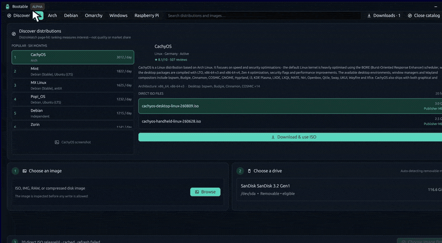
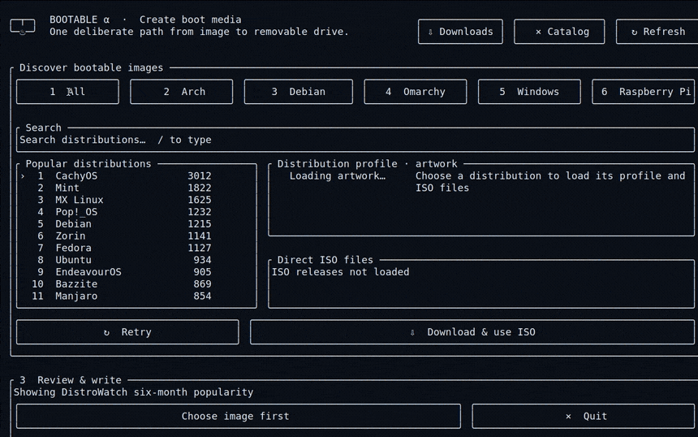

<p align="center"><a href="https://bootable.palash.dev"></a></p>

<p align="center"><strong>Write the right image to the right drive—and check the result.</strong></p>

<p align="center">
  <a href="https://bootable.palash.dev/download.html">Download</a> ·
  <a href="https://bootable.palash.dev/features.html">Features</a> ·
  <a href="https://bootable.palash.dev/guides.html">Guides</a> ·
  <a href="docs/safety.md">Safety</a> ·
  <a href="https://bootable.palash.dev/faq.html">FAQ</a> ·
  <a href="CHANGELOG.md">Changelog</a> ·
  <a href="https://github.com/debpalash/bootable/issues/new?template=alpha-report.yml">Alpha feedback</a>
</p>

<p align="center">
  <a href="https://github.com/debpalash/bootable/actions/workflows/ci.yml"></a>
  <a href="https://github.com/debpalash/bootable/releases"></a>
  <a href="LICENSE"></a>
</p>

> [!CAUTION]
> **Public alpha.** Builds are not code-signed or notarized. Use expendable USB or SD media,
> verify the physical target, and keep backups. Only the newest alpha receives fixes.

Bootable writes and verifies bootable USB and SD media on Linux, Windows, and macOS. It handles
local files and catalog downloads, raw and compressed images, and extracted FAT32 Windows installer
media. The write path is strict: inspect source → select a whole removable disk → review the plan →
write → verify.

<table>
  <tr>
    <td width="50%"></td>
    <td width="50%"></td>
  </tr>
  <tr>
    <td align="center"><strong>Native desktop</strong></td>
    <td align="center"><strong>TUI + mouse</strong></td>
  </tr>
</table>

At a glance
-----------

| Fact | Scope |
| --- | --- |
| 8 pre-write gates | Whole disk; USB or removable; writable; non-system; enough capacity; explicit review; stable-ID recheck; unmount |
| 7 source formats | ISO, IMG, RAW, XZ, gzip, Zstandard, bzip2 |
| 4 checksum algorithms | MD5, SHA-1, SHA-256, SHA-512; strongest supported publisher digest wins |
| 2 complete interfaces | GUI and TUI share labels, section order, plans, progress, cancellation, errors, and retries |
| 1 elevated component for interactive writes | The fixed helper; UI, network, catalog, and image parsing remain unprivileged |

Install
-------

Release archives include SHA-256 sidecars and GitHub build provenance. They do not include platform
code signatures. Exact files and sizes are listed on the [download page](https://bootable.palash.dev/download.html).

### Linux x86-64

```sh
# Desktop
curl -fsSL https://bootable.palash.dev/install.sh | sh -s -- --gui

# TUI
curl -fsSL https://bootable.palash.dev/install.sh | sh -s -- --tui

# Both
curl -fsSL https://bootable.palash.dev/install.sh | sh -s -- --all
```

The installer verifies the archive's SHA-256 sidecar and installs the root-owned write helper after
administrator authentication. Review [`install.sh`](scripts/install.sh) first. Set
`BOOTABLE_SKIP_PRIVILEGED_HELPER=1` for a non-writing install.

### macOS Apple Silicon

Use the same command and choose `--gui`, `--tui`, or `--all`. The installer places the fixed helper
under `/Library/PrivilegedHelperTools`. Gatekeeper may warn because this alpha is not signed or notarized.

### Windows 10+ x86-64

Download the ZIP and `.sha256` file, verify the archive, extract it, then run:

```powershell
powershell -NoProfile -ExecutionPolicy Bypass -File .\install.ps1 -Variant All
```

Bootable is installed under `Program Files`. The interface stays unelevated; UAC appears only when
an approved write starts.

What it writes
--------------

### Raw and compressed images

- ISO, IMG, RAW, XZ, gzip, Zstandard, and bzip2
- Streaming decompression without a second unpacked copy
- Expanded-size measurement before target approval
- SHA-256 read-back over the exact written range

### Windows installer media

- GPT or MBR with one FAT32 Microsoft Basic Data partition
- Oversized WIM splitting
- Ten explicit Windows setup choices: hardware requirements, offline account, local account,
  regional settings, privacy, BitLocker, QoL, CA 2023, SkuSiPolicy, and S Mode
- Pre-erasure source checks and post-copy UEFI, payload, split-WIM, and FAT32 audits

### Downloads and drive tools

- DistroWatch, Omarchy, and Raspberry Pi catalogs, plus local files
- Queue, pause, resume, cancel, retry, and publisher checksum verification
- Bad-block and fake-capacity checks
- RAW backup on Linux and macOS

What verification proves
------------------------

| Check | It proves | It does not prove |
| --- | --- | --- |
| Publisher checksum | Source bytes match the publisher's checksum file | The publisher or its website was not compromised |
| Raw read-back | The written range matches the expanded source stream | Every firmware can boot the image |
| Windows boot-tree audit | Required UEFI and installer files exist and satisfy media rules | Windows Setup will complete on every machine |

Platform support and limits
---------------------------

| Platform | Architecture | Raw/compressed | Windows installer | RAW backup |
| --- | --- | --- | --- | --- |
| Linux | x86-64 | Yes | Yes | Yes |
| Windows 10+ | x86-64 | Yes | Yes | No |
| macOS | Apple Silicon | Yes | Yes | Yes |

Current limits:

- Builds are unsigned; the macOS build is not notarized.
- Constructed Windows media targets UEFI. Legacy BIOS helpers are not implemented.
- Linux persistence, Windows To Go, DOS media, and multiboot are not implemented.
- Oversized Windows payload and CA 2023 operations require `wimtools` on Linux or `wimlib` on macOS.
- Verification is not a completed operating-system installation test.

Privilege boundary
------------------

| Executable | Role | Privilege |
| --- | --- | --- |
| `bootable` | TUI and CLI | Normal user |
| `bootable-desktop` | Native desktop | Normal user |
| `bootable-helper` | Revalidate, erase, write, verify, back up | Root or administrator |

The helper has no catalog, download, terminal, or graphics code. Users do not launch it directly.
Read the [architecture](docs/architecture.md) and [safety design](docs/safety.md).

Run
---

```sh
bootable-desktop       # Desktop app
bootable               # TUI
bootable --help        # CLI options
```

Build and test
--------------

Linux dependencies:

```sh
sudo apt install build-essential pkg-config libxkbcommon-x11-dev \
  xorriso 7zip gdisk parted dosfstools wimtools
```

```sh
cargo build --release --workspace
cargo fmt --all --check
cargo clippy --workspace --all-targets -- -D warnings
cargo test --workspace
```

Destructive block-I/O tests use temporary files and a root-only loop-device harness. Loop devices
remain ineligible as application targets. The UEFI smoke harness attaches media read-only and checks
a deterministic OVMF frame. See [validation](docs/validation.md).

Project documents
-----------------

[Architecture](docs/architecture.md) · [Safety](docs/safety.md) ·
[Validation](docs/validation.md) · [GUI/TUI parity](docs/ui-parity.md) ·
[Roadmap](docs/roadmap.md) · [Changelog](CHANGELOG.md) ·
[Contributing](CONTRIBUTING.md) · [Security](SECURITY.md)

Support
-------

[Ko-fi](https://ko-fi.com/debpalash) · [PayPal](https://paypal.me/palashCoder)

Prior art
---------

Bootable is an original Apache-2.0 implementation informed by
[Rufus](https://github.com/pbatard/rufus), [WoeUSB-ng](https://github.com/WoeUSB/WoeUSB-ng),
[Etcher](https://github.com/balena-io/etcher), and [PyUSB](https://github.com/pyusb/pyusb).
No source code was copied.

License
-------

[Apache-2.0](LICENSE)
