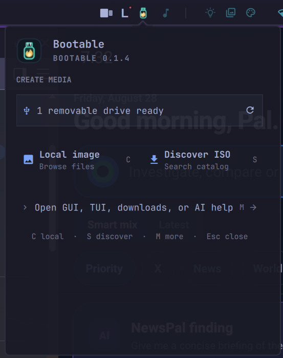

<p align="center"><a href="https://bootable.palash.dev"></a></p>

<p align="center"><strong>Create and verify bootable USB and SD drives.</strong></p>

<p align="center">
  <a href="https://github.com/debpalash/bootable/releases/download/v0.1.1/bootable-0.1.1-x86_64.AppImage"><strong>Linux AppImage</strong></a> ·
  <a href="https://github.com/debpalash/bootable/releases/download/v0.1.1/bootable-0.1.1-x86_64-setup.exe"><strong>Windows installer</strong></a> ·
  <a href="https://github.com/debpalash/bootable/releases/download/v0.1.1/bootable-0.1.1-aarch64.dmg"><strong>macOS DMG</strong></a> ·
  <a href="https://bootable.palash.dev/download.html">All downloads and checksums</a>
</p>

Bootable finds, downloads, writes, and verifies operating-system images. Use the desktop app or TUI on Linux, Windows, and macOS.

Major features
--------------

- Browse DistroWatch, Omarchy, and Raspberry Pi images without leaving the app.
- Write ISO, IMG, RAW, XZ, gzip, Zstandard, and bzip2 files.
- Create FAT32 Windows installation media, including split WIM files.
- Verify publisher checksums and read back every written byte.
- Reject system disks and require explicit review before erasing a removable drive.
- Follow the same Source → Target → Review & write flow in the GUI and TUI.

GUI and TUI
-----------

Both interfaces keep the same three steps visible:

**Source → Target → Review & write**

Discovery opens only when needed. Image-specific setup appears after source inspection. Review stays
locked until you select an eligible removable drive. Bootable never selects a drive automatically.

<table>
  <tr>
    <th>Desktop GUI</th>
  </tr>
  <tr>
    <td></td>
  </tr>
  <tr>
    <td align="center">Pointer and keyboard</td>
  </tr>
  <tr>
    <th>Terminal TUI</th>
  </tr>
  <tr>
    <td></td>
  </tr>
  <tr>
    <td align="center">Keyboard and mouse</td>
  </tr>
</table>

Omarchy plugin
--------------

The [Bootable for Omarchy](https://github.com/debpalash/omarchy-bootable) plugin puts image
discovery, removable-drive review, and live download/write progress in the Omarchy bar. It keeps
the full desktop GUI and TUI one click away.

<p align="center"></p>

Install Bootable first. The complete in-panel workflow requires Omarchy 4 or newer and Bootable
0.1.4 or newer. Then install and enable the plugin:

```sh
omarchy plugin add https://github.com/debpalash/omarchy-bootable.git --enable --yes
```

Click the Bootable icon in the right side of the bar. The plugin never selects a target
automatically; choosing a removable drive and approving its erase plan remain separate actions.
See the [Omarchy plugin guide](https://bootable.palash.dev/omarchy-plugin.html) for usage, updates,
removal, and requirements.

> [!CAUTION]
> Bootable is unsigned. Check the selected drive, keep backups, and use media you can erase.

Install
-------

Linux or macOS:

```sh
# Desktop app
curl -fsSL https://bootable.palash.dev/install.sh | sh -s -- --gui

# TUI
curl -fsSL https://bootable.palash.dev/install.sh | sh -s -- --tui

# Both
curl -fsSL https://bootable.palash.dev/install.sh | sh -s -- --all
```

Native packages are also available as DEB/RPM on Linux, MSI on Windows, and DMG on macOS. For the
portable Windows ZIP, extract it and run:

```powershell
powershell -NoProfile -ExecutionPolicy Bypass -File .\install.ps1 -Variant All
```

The interface stays unprivileged. Administrator access is requested only for an approved write. See the [download page](https://bootable.palash.dev/download.html) for requirements, checksums, and known limits.

Run
---

```sh
bootable-desktop  # Desktop app
bootable          # TUI
```

Project links
-------------

[Website](https://bootable.palash.dev) ·
[Features](https://bootable.palash.dev/features.html) ·
[Guides](https://bootable.palash.dev/guides.html) ·
[FAQ](https://bootable.palash.dev/faq.html) ·
[Safety](docs/safety.md) ·
[Architecture](docs/architecture.md) ·
[Validation](docs/validation.md) ·
[GUI/TUI parity](docs/ui-parity.md) ·
[Release channels](docs/releases.md) ·
[Contributing](CONTRIBUTING.md) ·
[Changelog](CHANGELOG.md) ·
[Report a problem](https://github.com/debpalash/bootable/issues/new?template=bug-report.yml)

Build and test
--------------

```sh
cargo build --release --workspace
cargo fmt --all --check
cargo clippy --workspace --all-targets -- -D warnings
cargo test --workspace
```

See [validation](docs/validation.md) for platform dependencies and destructive test isolation.

License
-------

[Apache-2.0](LICENSE)
