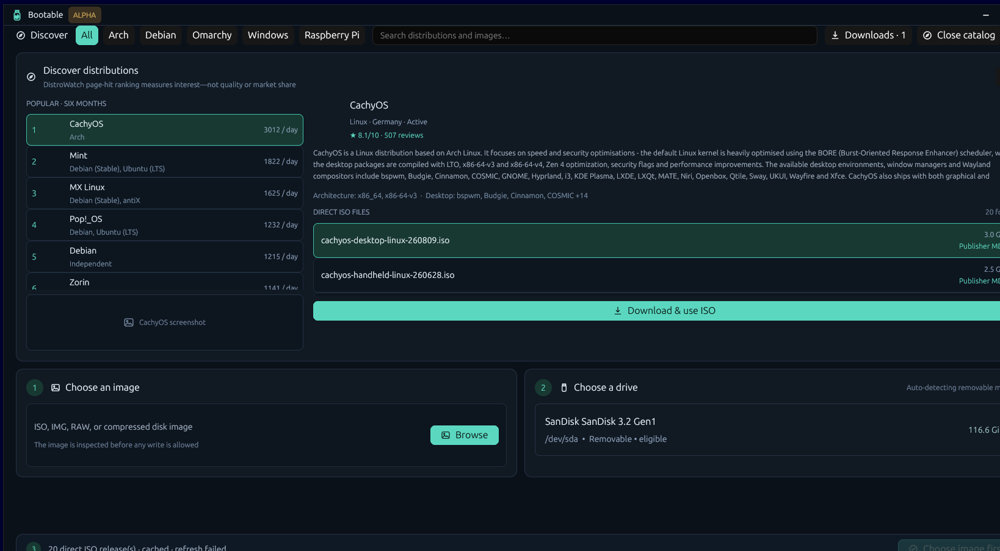
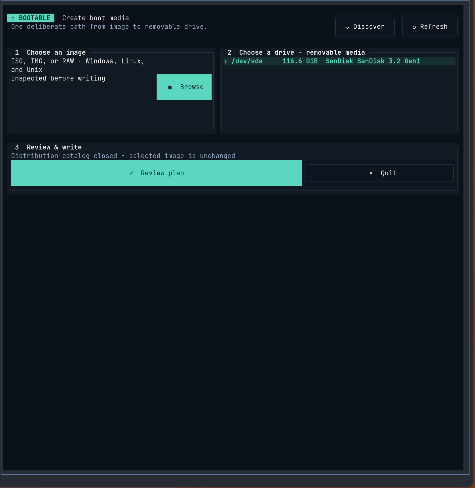
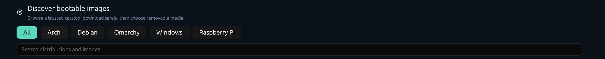

<p align="center">
  
</p>

<h1 align="center">Know exactly what will happen before your USB is erased.</h1>

<p align="center">
  A safety-first boot-media writer with one Rust engine, a native desktop app, and a mouse-friendly TUI.
</p>

<p align="center">
  <a href="https://github.com/debpalash/bootable/actions/workflows/ci.yml"></a>
  <a href="https://github.com/debpalash/bootable/releases"></a>
  <a href="LICENSE"></a>
  
</p>

> [!CAUTION]
> **Bootable 0.1.0-alpha.1 is pre-release software that intentionally erases removable drives.**
> Check the physical device, keep backups, and do not use it on irreplaceable media. Linux writing
> is functional. macOS and Windows have conservative removable-device discovery and authenticated
> narrow-helper raw write/verification paths; the full applications stay unprivileged.
> Native Windows-media creation is implemented on Linux and Windows; macOS conversion is not complete.

Stop bouncing between a distro website, a checksum tool, a decompressor, and a USB writer.
Bootable discovers images, downloads and verifies them, identifies removable media, explains the
write plan, asks for one explicit consequence acknowledgment, and verifies the finished device.

- **See the target, method, and permanent consequences before writing.**
- **Discover Linux, Omarchy, Windows, and Raspberry Pi media without leaving the app.**
- **Use the same workflow with a native GPUI desktop app or a Ratatui terminal app.**
- **Keep internal and system disks out of the target list.**
- **Create Windows 11 installation media with guarded Rufus-inspired setup choices.**

## Install the alpha

The installer downloads the release archive, verifies its SHA-256 sidecar, and installs under
`~/.local`. Read [`scripts/install.sh`](scripts/install.sh) before piping it into a shell.

Desktop app:

```bash
curl -fsSL https://raw.githubusercontent.com/debpalash/bootable/main/scripts/install.sh | sh -s -- --gui
```

Terminal app:

```bash
curl -fsSL https://raw.githubusercontent.com/debpalash/bootable/main/scripts/install.sh | sh -s -- --tui
```

Install both:

```bash
curl -fsSL https://raw.githubusercontent.com/debpalash/bootable/main/scripts/install.sh | sh -s -- --all
```

On Windows, download the release ZIP, verify its adjacent SHA-256 file, extract it, and run:

```powershell
powershell -NoProfile -ExecutionPolicy Bypass -File .\install.ps1 -Variant All
```

The Windows installer requests UAC once to place the narrow helper under protected Program Files.
Normal discovery and downloads remain unelevated; a later write prompts only for that helper.

## Two interfaces. One safety model.

| Native desktop | Mouse-friendly terminal UI |
| --- | --- |
|  |  |

<p align="center"></p>

Both interfaces expose the same source, target, discovery, download, review, confirmation,
progress, failure, and retry states. The TUI renders catalog artwork through Kitty, Sixel, or
iTerm2 graphics when available and falls back to colored Unicode half-blocks everywhere else.

## What works in this alpha

- Linux removable-drive discovery with stable-device and system-disk safety gates.
- Hybrid ISO/IMG raw writing with byte-range SHA-256 read-back verification.
- Streaming XZ, gzip, Zstandard, and bzip2 raw/hybrid images with expanded-size capacity preflight;
  inspection stays off both render loops and no decompressed staging file is required.
- GPT or MBR Windows installer creation using FAT32 and split WIM payloads.
- Windows 11 requirements, account, regional, privacy, BitLocker, QoL, CA 2023, SkuSiPolicy, and
  S Mode choices serialized into the reviewed plan.
- DistroWatch discovery and search, popularity-ranked Arch/Debian views, Omarchy filtering, and
  direct HTTPS ISO resolution.
- Official Raspberry Pi Imager catalog browsing, board filtering, compressed-image extraction,
  and source-provided checksum verification.
- Persistent FIFO download queue and history shared by both interfaces, with pause, cancellation,
  retry, validated HTTP Range resume, progress, speed, ETA, atomic finalization, and free-space
  preflight.
- Publisher checksum discovery for direct sidecars and GNU/BSD checksum manifests; MD5, SHA-1,
  SHA-256, and SHA-512 are persisted with queued jobs and verified before atomic finalization. Both
  interfaces explicitly distinguish publisher-verified media from HTTPS-only transfers.
- MD5, SHA-1, SHA-256, and SHA-512 calculation; destructive bad-block tests; atomic raw backups.

The detailed implementation inventory lives in [Rufus parity](docs/rufus-parity.md), and unfinished
work is tracked openly in the [roadmap](docs/roadmap.md).

## Why another writer?

Most Unix images are already hybrid disk images and should be copied exactly. Windows installer
media needs a different path when a file exceeds FAT32's 4 GiB limit. Bootable chooses the
strategy from the image instead of applying one recipe to every ISO.

| Image | Strategy | Verification |
| --- | --- | --- |
| Hybrid Linux/Unix ISO | Raw image write | SHA-256 over the written byte range |
| `.img` / `.raw` disk image | Raw image write | SHA-256 over the written byte range |
| Windows installer ISO | GPT + FAT32 Microsoft Basic Data partition; split WIM if needed | UEFI files, payload, and FAT32 file-size audit |
| Optical-only ISO | Refused for now | A future conversion strategy is required |

The Windows partition is deliberately Microsoft Basic Data (`0700` in `sgdisk`), not an EFI
System Partition. Windows PE can hide an ESP during setup; this distinction was reproduced and
validated in an OVMF/QEMU boot test before this project was started.

## Build and inspect

On Ubuntu, install the native build and imaging tools first:

```bash
sudo apt install build-essential pkg-config libxkbcommon-x11-dev \
  xorriso 7zip gdisk parted dosfstools wimtools
```

```bash
cargo build
cargo run -p bootable-tui -- devices
cargo run -p bootable-tui -- inspect ~/Downloads/linux.iso
cargo run -p bootable-tui -- plan ~/Downloads/linux.iso /dev/sdX
```

Browse the current catalog, resolve one distribution's direct images, or download a selected
release without opening the interactive interface:

```bash
cargo run -p bootable-tui -- catalog --limit 20
cargo run -p bootable-tui -- releases cachyos
cargo run -p bootable-tui -- download cachyos --index 0 --output ~/Downloads/cachyos.iso
cargo run -p bootable-tui -- pi-images --device pi5-64bit --limit 20
cargo run -p bootable-tui -- pi-download 0 --output ~/Downloads/raspberry-pi-os.img
```

`catalog` and `releases` also accept `--json`. ISO bytes are downloaded from the distribution's
linked source, not from DistroWatch itself. Some download sites do not expose stable direct ISO
links; Bootable reports those entries as unresolved instead of guessing a file URL.

Launch the interactive TUI with an optional source image:

```bash
cargo run -p bootable-tui -- --image ~/Downloads/linux.iso
```

The TUI uses the full terminal, places Source and Target side-by-side when wide, stacks them when
narrow, wraps option grids at compact widths, and lets catalog lists grow with the available height.
It supports keyboard and mouse input, clickable catalog and drive rows, automatic one-second device
refresh, and native open/save/folder dialogs. Discover stays open throughout browsing and
downloads. Press `g` to focus it; use `1` All, `2` Arch, `3` Debian, `4` Omarchy, `5` Windows, or
`6` Raspberry Pi; use left/right to
switch lists, `/` to type a live search, up/down to move, and Enter to resolve or download. Both
interfaces initially render a compact batch and progressively expose more matching catalog items
as the user scrolls. The GPUI app exposes the same
pointer-driven discovery, artwork, board filtering, selection, and dialog workflow with a dark
client-side titlebar. Windows setup options remain hidden until a Windows installer is inspected;
Linux/Unix and common boot-media controls likewise appear only after a compatible image is loaded.
Multi-choice Windows setup controls use independent checkboxes in both interfaces. The Windows tab
also carries the complete Rufus 4.15 Windows capability inventory, with working features separated
from still-unavailable features; unavailable and high-risk operations are never rendered as working
controls.

Press `m` in the TUI—or choose **Downloads** in either interface—to inspect the persistent download
queue. New jobs run FIFO, one at a time. Failed or interrupted jobs can be retried; Bootable resumes
only when the server returns a matching `206 Content-Range`, otherwise it safely restarts from byte
zero. Partial files are bound to their exact source and destination, unknown files are never
overwritten, and explicit cancellation removes Bootable-owned temporary data. Removing a completed
history entry never deletes the completed image.

After Review, both interactive applications open a blocking confirmation that names the physical
target, lists plan-derived changes, and explains permanent data loss and interruption risks. One
acknowledgment enables **Confirm erase & write**; no phrase typing is required interactively. Writing
runs outside the render/input loop and reports phase, percentage, bytes, throughput, ETA, elapsed
time, verification, failure details, and safe-removal success. Automatic drive refresh and exit
controls are locked while media is being modified. On Linux the interactive applications remain
unprivileged and request administrator authentication only when writing starts. A narrow root-owned
`bootable-helper` repeats target validation as root and streams progress back through a JSON protocol;
ordinary discovery, downloads, inspection, and planning never request elevation.

An active write can be stopped from either interface. Bootable forwards cancellation through the
privileged helper, terminates controlled media tools, stops on a chunk boundary, and flushes completed
raw writes before returning. Cancelled media is explicitly marked incomplete and must be rewritten
before it is used as boot media.

Both applications render their interface before starting remote discovery. DistroWatch profiles,
quick filters, ISO resolution, and Raspberry Pi catalog requests run in background tasks; loading
results update the existing view without blocking input or window resizing.

GUI/TUI parity is a project invariant: both adapters use the same section order, controls, loading,
cached, empty, failure, retry, and stale-response behavior. Remote discovery uses a 30-minute cache
under the operating system temporary directory. Cache files are replaced atomically; a failed
refresh can use older cached data with a visible warning, while corrupt cache data is ignored and
repaired by a successful network response. See [the parity contract](docs/ui-parity.md).

The Omarchy quick-access tab is deliberately limited to Omarchy and curated derivatives. Derivatives
that do not publish disk images are identified as installer workflows and cannot be selected for a
USB write. For example, Omarchy MX Mac installs onto an existing Asahi Arch Minimal system on an
Apple Silicon Mac and does not currently provide an ISO or IMG release.

Catalog downloads remain responsive in both interfaces and report connection, transfer, syncing,
checksum, extraction, expanded-image verification, and inspection stages. During transfer the
status includes bytes transferred, total bytes, percentage, current throughput, ETA, and a visual
progress bar.

Compute an image checksum without writing a drive:

```bash
cargo run -p bootable-tui -- checksum image.iso --algorithm sha256
```

Back up a removable drive to a raw image (administrator/root access is required for the device):

```bash
sudo target/release/bootable backup /dev/sdX usb-backup.img
```

The write command prints the plan and expected phrase when `--confirm` is absent. Writing requires
root privileges on Linux and the exact phrase from that fresh plan:

```bash
sudo target/debug/bootable write image.iso /dev/sdX \
  --confirm 'ERASE /dev/sdX SERIALSUFFIX'
```

For compatible Windows installer images, the plan and write commands accept
`--bypass-windows-11-requirements`, `--allow-windows-offline-account`,
`--windows-local-account USERNAME`, `--copy-windows-regional-options`,
`--minimize-windows-data-collection`, `--disable-windows-bitlocker`,
`--windows-quality-of-life`, `--use-windows-ca-2023`, `--apply-windows-skusi-policy`, and
`--force-windows-s-mode`. `--windows-partition-scheme gpt|mbr` selects the UEFI media layout.
These options are serialized into the reviewed plan and refuse to overwrite an existing
`autounattend.xml`.

Build the GPUI desktop application separately:

```bash
cargo build --release --workspace
./target/release/bootable-desktop
```

On Linux, install `bootable-helper` as root-owned `/usr/libexec/bootable-helper` together with
`packaging/app.bootable.write-media.policy`. The release installer performs this one privileged setup
step. Bootable refuses to elevate a user-writable helper; set `BOOTABLE_SKIP_PRIVILEGED_HELPER=1` only
for a catalog/inspection-only installation where device writing is intentionally unavailable.

## Current platform status

- Linux: device discovery, image inspection, planning, raw writing and verification, and Windows
  FAT32 media creation are implemented.
- Windows: USB-only `Get-Disk` discovery, stable identity revalidation, drive-letter detachment,
  UAC-authenticated `PhysicalDrive` raw writing, cancellation, and verification are implemented.
  The app accepts only the fixed Program Files helper after owner and ACL validation. Native GPT/MBR
  FAT32 installer creation uses Windows ISO mounting and DISM split-WIM/CA-2023 support, with source
  preflight before erasure and boot-tree verification afterward. Windows' formatter limits the media
  partition to just under 32 GiB; larger installer trees are refused. Raw backup currently requires
  an elevated process.
- macOS: whole removable/ejectable `IOMedia` discovery, root-disk exclusion, stable identity
  revalidation, `diskutil` unmounting, `/dev/rdisk` raw writing, backup, cancellation, and
  verification are implemented. The UI invokes a fixed root-owned helper through the macOS
  administrator prompt and a private Unix socket; extracted Windows FAT32 creation remains unfinished.
- Desktop and TUI: on Linux, destructive execution uses the same consequence confirmation, a
  polkit/pkexec authentication prompt, cancellable write protocol, and root-owned narrow
  `bootable-helper`; the full interface is never elevated. macOS follows the same narrow-helper
  design through `osascript` authorization. Windows uses the same reviewed helper protocol over an
  authenticated loopback-only channel and invokes the fixed helper through the native UAC prompt.

See [architecture](docs/architecture.md), [safety model](docs/safety.md), and the
[validation guide](docs/validation.md). The [roadmap](docs/roadmap.md) and
[Rufus parity](docs/rufus-parity.md) track implemented behavior and
the remaining cross-platform backends.

## Design references

Bootable is an original implementation informed by the product behavior of
[Rufus](https://github.com/pbatard/rufus), [WoeUSB-ng](https://github.com/WoeUSB/WoeUSB-ng),
[Etcher](https://github.com/balena-io/etcher), and [PyUSB](https://github.com/pyusb/pyusb).
No source code was copied from those projects. Rufus and WoeUSB-ng are GPL-3.0 projects; keeping
behavioral research separate avoids accidentally importing incompatible code into this
Apache-2.0 codebase.

Quality checks include rustfmt, Clippy, tests, and [aislop](https://github.com/scanaislop/aislop).

## License

Apache-2.0. See [LICENSE](LICENSE).
